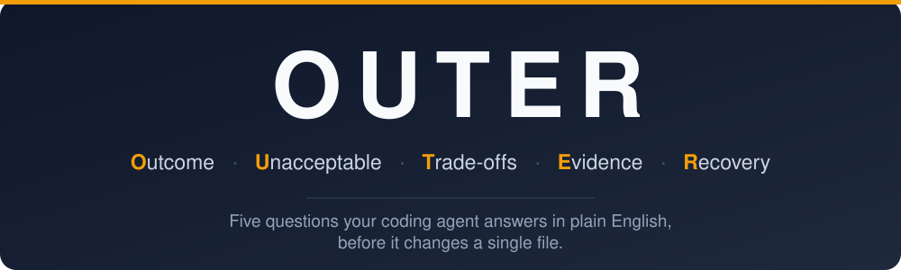
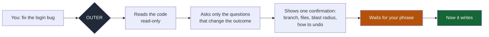
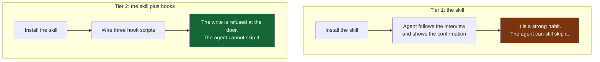
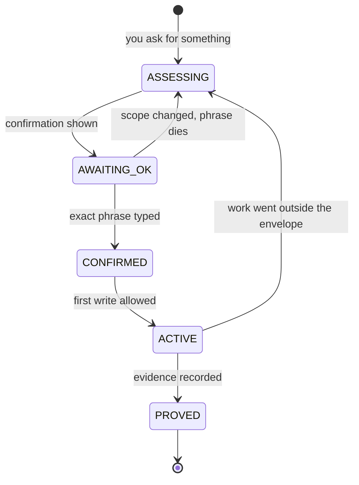

<div align="center">



</div>

# OUTER

### **O**utcome &nbsp;·&nbsp; **U**nacceptable &nbsp;·&nbsp; **T**rade-offs &nbsp;·&nbsp; **E**vidence &nbsp;·&nbsp; **R**ecovery

**Five questions your coding agent has to answer in plain English, before it changes a single file. Then you type a phrase, and only then can it write.**

```bash
npx skills add Shivak11/outer-engineering-loop
```

---

## The five questions

Every one of them exists because of a specific way an AI coding agent ruins your afternoon.

| | The question | What it stops |
|---|---|---|
| **O** | **Outcome.** What should be true when this works? | The agent solving a different problem, confidently and fast |
| **U** | **Unacceptable.** What must never happen, even once? | Charging the card twice. Logging everyone out. The thing nobody thought to forbid |
| **T** | **Trade-offs.** What are we giving up? | A decision made silently on your behalf, found three weeks later |
| **E** | **Evidence.** What would prove this works, beyond "looks right"? | "Done!" on code nobody ran |
| **R** | **Recovery.** How do we get back if it is wrong? | Discovering there is no way back, at the worst possible moment |

You answer these in ordinary language. The agent translates them into mechanisms. It never asks you to pick a database, a queue, a caching strategy, or a library, because those are its job and not yours.

Here is a real question it might ask:

> If two people claim the last seat at almost the same moment, can one of them be told to try again, or must both get a final answer immediately? *[race condition]*

That single line is the whole design. You rule on the product. It handles the engineering word in brackets.
## The thing this fixes

You are building with an AI agent. You type "fix the login bug". Thirty seconds later it has edited nine files, switched a branch, run a migration, and told you it is done.

Three questions you could not answer while it was happening:

1. Which branch was it on?
2. What else did those nine files touch?
3. If this is wrong, how do you get back?

The agent was not being reckless. It was being fast, and nobody told it to stop and check. Speed is the feature until the day it is the bug.

OUTER inserts one step before the first file changes. The agent works out what it is about to do, writes it down in ordinary language, and waits.



---

## What you actually see

Before anything changes, you get one block like this:

```
Change:            Fix session expiry so users are not logged out mid-form
Repository:        my-app  (worktree: ~/code/my-app)
Branch:            fix/session-expiry  (based on main @ 4c1e9a2)
Environment:       local only
Allowed changes:   edit files, run tests
Allowed paths:     src/auth/, src/hooks/useSession.ts
Allowed targets:   none
Excluded:          all-other-mutations, no migrations, no deploy, no push
Boundary:          the login screen and the token refresh are untouched
Blast radius:      anyone already signed in keeps their session; new sessions
                   get a 30-minute idle window instead of 10
Verification:      a failing test written first, then the same test passing
Recovery:          git restore the two files, or delete the branch

Reply exactly: APPROVE OUTER-7K2M9QX4
```

Until you type `APPROVE OUTER-7K2M9QX4`, the agent cannot write a file.

Not "should not". **Cannot.** A hook sits in front of every tool call and returns a refusal.

---

## Why a typed phrase and not a yes button

Because "yes" is cheap and you will click it while thinking about something else.

The phrase is generated fresh for each task. It is unique. To type it, you have to look at the block it appeared under. That is the whole trick: it costs you three seconds of attention at the exact moment attention is worth the most.

And these do **not** work:

| You type | What happens |
|---|---|
| `go ahead` | Treated as a new request, not consent |
| `yes`, `sure`, `do it` | Same. No approval recorded |
| The phrase from your last task | Rejected as stale |
| The right phrase, wrong branch | Rejected. The approval was bound to a branch |

If you change the branch, the target, the environment, or what you are actually asking for, the old phrase dies and you get a fresh confirmation. Consent does not leak from one task to the next.

---

## The two ways to run it



**Tier 1 is what `npx skills add` gives you.** One command, works in Claude Code, Codex, Cursor, and the rest. The agent reads the skill and follows it. This is guidance with real teeth, but it is still guidance.

**Tier 2 is the gate.** Four scripts in [`hooks/`](hooks/) that you wire into your agent's settings yourself. Now the refusal is mechanical. See [hooks/README.md](hooks/README.md).

A skill installer cannot write hooks into your agent's config, and it should not be able to. That is why the one-command version is Tier 1 only. It is a property of how skills install, not a feature held back.

---

## The lifecycle



`PROVED` is the fussy one. Source inspection does not earn it. "Looks good" does not earn it. A stale test run from before the change does not earn it. The agent has to say what it actually ran and what it actually saw, and keep proof of different kinds separate: reading the code is not running it, and running it locally is not running it in production.

---

## Install

**The skill, in one command:**

```bash
npx skills add Shivak11/outer-engineering-loop
```

Then start any task with `/plain-language-engineering-loop` in Claude Code, or just describe what you want and let the skill trigger itself.

**The gate**, if you want writes actually refused: follow [hooks/README.md](hooks/README.md). It takes about five minutes and needs Node.js, which your agent already requires.

---

## Honest limits

- **This is OUTER v3, preserved as it was written in August 2026.** It is an archived release, not an actively developed one. It is published because the design is worth reading and the gate still does its job: on Node 22.17.1 a read passes through and a write to a source file is refused with a fresh approval phrase. The rest of the flow has not been re-tested end to end since 2026.
- **It will slow you down.** That is the point, and it is a real cost. On a two-line CSS tweak it is overhead. The skill tries to stay quiet on small safe edits, but it will sometimes ask when you wish it had not.
- **Tier 1 cannot enforce anything.** An agent that decides to skip the skill will skip it. Only the hooks make refusal mechanical.
- **The hooks are opinionated about what counts as dangerous.** File writes, git operations, installs, builds, deploys, destructive external calls. Reading, searching, and scratch files pass through untouched.
- **`[skip-outer]`** exists for when you genuinely do not want the interview. It records what you skipped and names the biggest unexamined risk in one sentence, then gets out of the way. It authorises only the exact actions you named.

---

## Repository layout

```
skills/plain-language-engineering-loop/   the skill itself (Tier 1)
  SKILL.md                                the full interview and contract
  assets/                                 templates the agent fills in
  references/                             failure vocabulary, install notes
hooks/                                    the enforcement scripts (Tier 2)
  outer-interview-trigger.mjs             runs on every prompt you submit
  outer-pre-mutation-gate.mjs             refuses the write
  outer-confirmation-stop.mjs             binds approval to the task
  outer-state.mjs                         shared state, hashes only
assets/outer-banner.svg                   the wordmark
```

The state files store hashes and short status words. They never store your prompt text, your file paths, your approval phrase in readable form, or anything about your code.

---

## Licence

MIT. Take it, fork it, change it.
